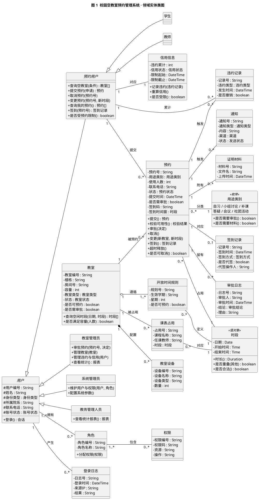
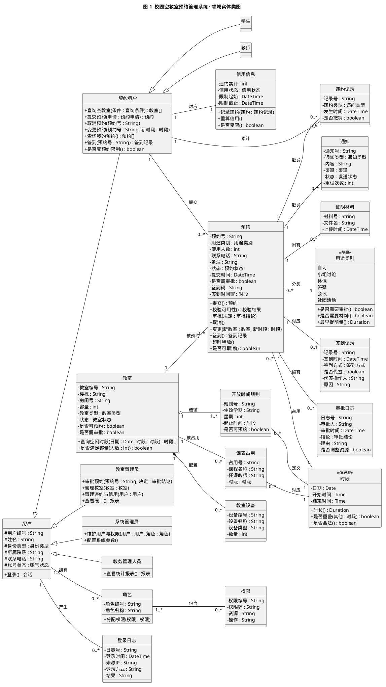
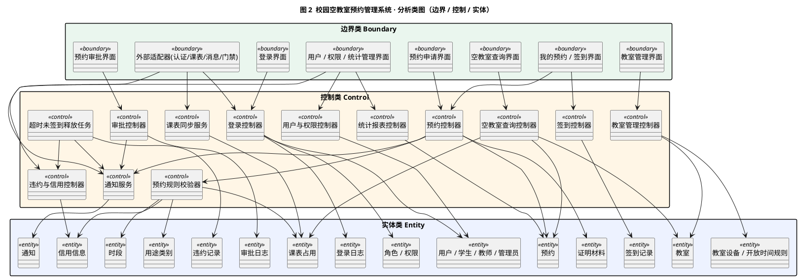
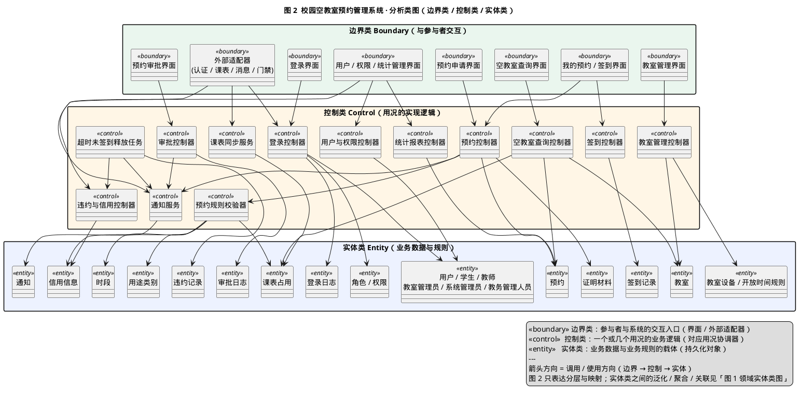

# 校园空教室预约管理系统 · 类图分析（分析模型）

| 项目 | 内容 |
| --- | --- |
| 课程 | 面向对象设计与分析 · 课堂作业（学期课设选题） |
| 选题 | 校园空教室预约管理系统（Campus Free Classroom Reservation Management System, CFRMS） |
| 阶段 | 系统分析（健壮分析 → 分析模型 / 类模型） |
| 交付物 | ① 领域实体类图（图 1）　② 分析类图（图 2）　③ 类清单与关系说明 |
| 上游文档 | `../user-case-analysis/用况分析.md`（需求说明 → 需求模型 / 用况模型） |
| 版本 | v1.0 |

---

## 0 从需求模型到分析模型

### 0.1 阶段衔接

按 OOSE（Jacobson）过程，需求分析产出**需求模型**（`用况分析.md`：用况图、用况文档、活动图），
下一步是**健壮分析**，把每个用况映射为三类分析类，产出**分析模型**——也就是本目录的类图。

| OOSE 阶段 | 输入 | 分析活动 | 输出（本文档） |
| --- | --- | --- | --- |
| 需求分析 | 需求说明 | 用况建模 | 需求模型（用况图 / 用况文档 / 活动图） |
| **健壮分析** | **需求模型** | **把用况映射为边界类 / 控制类 / 实体类，识别类间关系** | **分析模型（类图）** |

### 0.2 三类分析类

| 分析类 | 符号 | 含义 | 在本系统中的判别口径 |
| --- | --- | --- | --- |
| 边界类 | «boundary» | 参与者与系统交互的入口 | 面向用户的界面、面向外部系统的适配器 |
| 控制类 | «control» | 一个或几个用况的业务逻辑 | 用况协调器、任务、服务；命名以“控制器 / 任务 / 服务”结尾 |
| 实体类 | «entity» | 业务数据与业务规则的载体 | 需要持久化、被多个用况共享的业务对象 |

### 0.3 本次交付与上一阶段的关系

- `用况分析.md` 第 6 节已给出「用况 → 边界类 / 控制类 / 实体类」的初步映射；
- 本文档在此基础上**细化每个类的属性与操作**、**明确类之间的关系（泛化 / 聚合 / 组合 / 关联 / 依赖）与多重度**，形成两张类图：
  - **图 1 领域实体类图**：类图的“骨架”，重点表达实体类之间的结构与多重度；
  - **图 2 分析类图**：类图的“分层视图”，表达边界类 → 控制类 → 实体类的映射与调用方向。

---

## 1 类的识别

### 1.1 边界类（Boundary）

| 边界类 | 职责 | 对应用况 | 关联控制类 |
| --- | --- | --- | --- |
| 登录界面 | 展示欢迎页、触发统一身份认证、展示身份切换与受限提示 | UC-01 | 登录控制器 |
| 空教室查询界面 | 录入查询条件、展示空教室列表与排序、展示数据时效 | UC-02 | 空教室查询控制器 |
| 预约申请界面 | 填写预约表单、上传证明材料、展示校验结果与凭证 | UC-03、UC-05 | 预约控制器、预约规则校验器 |
| 我的预约 / 签到界面 | 查看在途与历史预约、触发取消 / 变更 / 签到、扫码入口 | UC-07、UC-08、UC-09、UC-10 | 预约控制器、签到控制器 |
| 预约审批界面 | 展示审批待办与详情、批量审批、填写审批结论与理由 | UC-06 | 审批控制器 |
| 教室管理界面 | 维护教室基础数据、设备、开放时间与可用状态、批量导入 | UC-13 | 教室管理控制器 |
| 用户 / 权限 / 统计界面 | 角色权限分配、账号冻结、统计报表与导出 | UC-15、UC-16、UC-12 | 用户与权限控制器、统计报表控制器、违约与信用控制器 |
| 外部适配器（认证 / 课表 / 消息 / 门禁） | 封装统一身份认证平台、教务排课系统、消息推送服务、门禁系统的外部接口 | UC-01、UC-14、UC-17、UC-10 | 登录控制器、课表同步服务、通知服务 |

> 边界类只负责“呈现与采集”，不写业务规则；所有校验与状态变更都委托给控制类。

### 1.2 控制类（Control）

| 控制类 | 职责 | 对应主要用况 | 协作实体类 |
| --- | --- | --- | --- |
| 登录控制器 | 向认证平台换取身份、映射角色权限、建立会话、写登录日志 | UC-01 | 用户、角色、权限、登录日志 |
| 空教室查询控制器 | 合并课表占用、有效预约与教室状态，计算空教室集合并排序 | UC-02 | 教室、课表占用、预约 |
| 预约控制器 | 编排“校验 → 占位 → 写记录 → 生成凭证 → 通知” | UC-03、UC-08、UC-09 | 预约、时段、证明材料、通知 |
| 预约规则校验器 | 集中实现时间窗 / 冲突 / 容量 / 信用 / 在途规则 | UC-04 | 时段、课表占用、信用信息、用途类别 |
| 审批控制器 | 处理通过 / 驳回 / 调整 / 退回补充，写审批日志 | UC-06 | 预约、审批日志、教室 |
| 签到控制器 | 校验凭证与签到窗，写签到记录，结束预约并释放时段 | UC-10 | 预约、签到记录、教室 |
| 超时未签到释放任务 | 定时扫描超时未签到预约，释放时段并联动违约与通知 | UC-11 | 预约、违约记录、信用信息、通知 |
| 教室管理控制器 | 增删改教室 / 设备 / 开放时间，处理停用与封闭的冲突预约 | UC-13 | 教室、教室设备、开放时间规则 |
| 违约与信用控制器 | 记录违约、重算信用、设置 / 解除预约限制、撤销违约 | UC-12 | 违约记录、信用信息 |
| 用户与权限控制器 | 角色与权限分配、账号冻结 | UC-15 | 用户、角色、权限 |
| 统计报表控制器 | 统计使用率 / 空置率 / 违约率并导出 | UC-16 | 预约、教室、违约记录 |
| 课表同步服务 | 拉取教务排课数据并生成不可预约时段 | UC-14 | 课表占用、教室 |
| 通知服务 | 编排审批结果 / 签到提醒 / 超时释放 / 违约通知，失败重试 | UC-17 | 通知 |

> **规则集中化**：UC-03、UC-08、UC-10 都依赖同一套可用性校验，故抽出唯一的「预约规则校验器」，
> 对应 `用况分析.md` 中 UC-04 的 «include» 关系，避免规则散落在多个控制类中。

### 1.3 实体类（Entity）

| 实体类 | 关键属性 | 关键操作 | 涉及用况 |
| --- | --- | --- | --- |
| 用户（抽象） | 用户编号、姓名、身份类型、所属院系、联系电话、账号状态 | 登录 | UC-01、UC-15 |
| 预约用户（抽象） | —（泛化自用户） | 查询空教室、提交 / 取消 / 变更预约、签到、是否受限 | UC-02、UC-03、UC-07、UC-08、UC-09、UC-10 |
| 学生 / 教师 | —（泛化自预约用户） | 继承预约用户行为 | 同上 |
| 教室管理员 | —（泛化自用户） | 审批预约、管理教室、管理违约与信用、查看统计 | UC-06、UC-12、UC-13、UC-16 |
| 系统管理员 | —（泛化自用户） | 维护用户与权限、配置系统参数 | UC-15 |
| 教务管理人员 | —（泛化自用户） | 查看统计报表 | UC-16 |
| 角色 / 权限 | 角色编号、角色名、权限码、资源、操作 | 分配权限 | UC-01、UC-15 |
| 登录日志 | 日志号、登录时间、来源 IP、登录方式、结果 | — | UC-01 |
| 信用信息 | 违约累计、信用状态、限制起始 / 截止 | 记录违约、重算信用、是否受限 | UC-07、UC-11、UC-12 |
| 教室 | 教室编号、楼栋、房间号、容量、类型、状态、是否可预约、是否需审批 | 查询空闲时段、是否满足容量 | UC-02、UC-03、UC-13 |
| 教室设备 | 设备编号、名称、类型、数量 | — | UC-13（用于 UC-02 筛选） |
| 开放时间规则 | 规则号、生效学期、星期、起止时间、是否可预约 | — | UC-02、UC-13 |
| 时段（值对象） | 日期、开始时间、结束时间 | 时长、是否重叠、是否合法 | UC-02、UC-03、UC-04 |
| 课表占用 | 占用号、课程名称、任课教师、时段 | — | UC-02、UC-14 |
| 预约 | 预约号、用途类别、使用人数、状态、提交时间、是否需审批、签到码、签到时间窗 | 提交、校验可用性、审批、取消、变更、签到、超时释放 | UC-03、UC-06、UC-07、UC-08、UC-10、UC-11 |
| 用途类别（枚举） | 自习 / 小组讨论 / 补课 / 答疑 / 会议 / 社团活动 | 是否需要审批、是否需要材料、最早提前量 | UC-03、UC-05、UC-06 |
| 签到记录 | 记录号、签到时间、签到方式、是否代签、代签操作人 | — | UC-10、UC-11 |
| 审批日志 | 日志号、审批人、审批时间、结论、理由、是否调整资源 | — | UC-06 |
| 违约记录 | 记录号、违约类型、发生时间、是否撤销 | — | UC-07、UC-11、UC-12 |
| 证明材料 | 材料号、文件名、上传时间 | — | UC-05 |
| 通知 | 通知号、类型、内容、渠道、状态、重试次数 | — | UC-03、UC-06、UC-07、UC-11、UC-17 |

> 说明：`预约状态`、`信用状态`、`教室状态`、`签到方式`、`审批结论` 等建模为**枚举型**，
> 仅作为属性类型出现；`系统参数`（违约阈值、可预约天数、单次时长上限等，对应 NFR-06）作为配置实体处理，
> 为保证图面清晰，未在图中单独绘制，其取值由业务规则 BR-03 / BR-07 / BR-09 约束。

---

## 2 类之间的关系

### 2.1 泛化（Generalization）

| 子类 | 父类 | 理由 |
| --- | --- | --- |
| 预约用户 | 用户 | 预约用户继承“登录、身份、联系方式”等公共属性 |
| 学生 / 教师 | 预约用户 | 二者对查询 / 预约 / 取消 / 签到行为完全一致，仅业务参数（用途、时间窗）不同 |
| 教室管理员 / 系统管理员 / 教务管理人员 | 用户 | 三类管理员共享用户公共属性，各自扩展职责操作 |

> 与用况图一致：用况图把“学生 / 教师”泛化为“预约用户”以减少重复关联；
> 类图用同样的泛化结构对应，保证需求模型与分析模型可追溯。

### 2.2 关联（Association，含多重度）

| 关联 | 多重度 | 语义 | 业务依据 |
| --- | --- | --- | --- |
| 用户 — 角色 | 1..* — 0..* | 一个用户可持有多个角色，一个角色可赋予多个用户 | BR-01、UC-15 |
| 角色 — 权限 | 1..* — 0..* | 角色是权限的集合 | UC-15 |
| 用户 — 登录日志 | 1 — 0..* | 用户每次登录产生一条日志 | UC-01 |
| 预约用户 — 信用信息 | 1 — 1 | 每个预约用户对应一份信用信息 | BR-07、UC-12 |
| 教室 — 课表占用 | 1 — 0..* | 一间教室可有多个课表占用时段 | UC-14 |
| 教室 — 预约 | 1 — 0..* | 一间教室可有多个预约 | UC-03 |
| 预约用户 — 预约 | 1 — 0..* | 一个用户可提交多个预约 | UC-03 |
| 预约 — 时段 | 0..* — 1 | 每条预约占用一个时段；同一时段值可被多条预约引用 | BR-03、BR-04 |
| 预约 — 用途类别 | 0..* — 1 | 每条预约属于一个用途类别，决定是否需审批 / 材料 | BR-05、BR-11 |
| 预约 — 证明材料 | 1 — 0..* | 活动类预约需附证明材料 | UC-05、BR-11 |
| 预约 — 签到记录 | 1 — 0..1 | 一条预约最多有一条有效签到记录 | UC-10 |
| 预约 — 审批日志 | 1 — 0..* | 需审批的预约留有多条（含调整 / 退回）审批日志 | UC-06、BR-09 |
| 预约 — 违约记录 | 1 — 0..* | 一条预约可触发违约记录 | BR-07、BR-10 |
| 预约用户 — 违约记录 | 1 — 0..* | 违约记录累计到用户信用 | BR-07 |
| 预约 — 通知 | 1 — 0..* | 预约状态变化触发通知 | UC-17 |
| 课表占用 — 时段 | 0..* — 1 | 课表占用对应一个时段 | UC-14 |
| 开放时间规则 — 时段 | 0..* — 1 | 规则定义可预约的时段 | UC-13 |

### 2.3 聚合与组合

| 关系 | 类型 | 说明 |
| --- | --- | --- |
| 教室 ◆— 教室设备 | 组合（composition） | 设备依附于教室存在，教室删除则其设备配置一并移除 |
| 教室 ◇— 开放时间规则 | 聚合（aggregation） | 开放时间规则按学期组织，可独立于单间教室维护与复用 |

### 2.4 依赖（Dependency）

图 2 中的箭头均为**依赖**，方向遵循分层原则：

`边界类 → 控制类 → 实体类`，且控制类之间允许 `预约控制器 → 预约规则校验器`、`超时释放任务 → 违约与信用控制器` 等协作依赖。

---

## 3 类图

### 3.1 图 1 领域实体类图





> 源文件：`diagrams/class-diagram-domain.puml`；矢量图：`diagrams/svg/类图-领域实体类图.svg`。

### 3.2 图 2 分析类图（边界 / 控制 / 实体）





> 源文件：`diagrams/class-diagram-analysis.puml`；矢量图：`diagrams/svg/类图-分析类图.svg`。

---

## 4 关键设计说明

1. **时段建模为值对象**：`时段` 只有日期与起止时间，无独立标识；预约、课表占用、开放时间规则都复用它，
   冲突判定（BR-04）集中在 `时段.是否重叠()` 与 `预约规则校验器`，避免各处重复实现。
2. **用途类别驱动规则**：`用途类别` 是枚举型，其“是否需审批 / 是否需材料 / 最早提前量”直接实现
   BR-05、BR-11，把“即时类 / 需审批类”的差异收敛到数据，而非散落在界面判断中。
3. **规则集中化**：UC-03、UC-08、UC-10 的共用校验（UC-04）由唯一的 `预约规则校验器` 承担，
   与用况图中的 «include» 一一对应。
4. **状态与幂等**：`预约.状态` 覆盖“待审批 → 已生效 → 使用中 → 已完成 / 已取消 / 已驳回 / 已自动释放”，
   `超时未签到释放任务` 与 `预约.超时释放()` 共同保证 NFR-02 的幂等与并发一致性（同教室同时段唯一）。
5. **外部系统以边界类封装**：统一身份认证、教务排课、消息推送、门禁都通过适配器边界类接入，
   对应 NFR-03 的降级策略与 NFR-05 的可用性要求，业务层不直接依赖外部协议。
6. **通知集中编排**：UC-03 / UC-06 / UC-07 / UC-11 均触发通知，统一由 `通知服务` 落库并重试，
   对应 UC-17 的 «include» 关系与 NFR-07 的可观测性要求。

---

## 5 用况 → 类 追溯矩阵

| 用况 | 边界类 | 控制类 | 实体类 |
| --- | --- | --- | --- |
| UC-01 登录与身份认证 | 登录界面、外部适配器（认证） | 登录控制器 | 用户、角色、权限、登录日志 |
| UC-02 查询空教室 | 空教室查询界面 | 空教室查询控制器 | 教室、课表占用、预约、时段 |
| UC-03 提交预约申请 | 预约申请界面 | 预约控制器、预约规则校验器、通知服务 | 预约、时段、用途类别、信用信息 |
| UC-04 校验预约可用性 | —（被调用） | 预约规则校验器 | 时段、课表占用、信用信息、用途类别 |
| UC-05 提交证明材料 | 预约申请界面 | 预约控制器 | 证明材料、预约 |
| UC-06 审批预约申请 | 预约审批界面 | 审批控制器、通知服务 | 预约、审批日志、教室 |
| UC-07 取消预约 | 我的预约界面 | 预约控制器、违约与信用控制器 | 预约、违约记录、通知 |
| UC-08 变更预约 | 我的预约界面 | 预约控制器、预约规则校验器 | 预约、时段、教室 |
| UC-09 查询我的预约 | 我的预约界面 | 预约控制器 | 预约 |
| UC-10 签到核验 | 我的预约 / 签到界面 | 签到控制器、预约规则校验器 | 预约、签到记录、教室 |
| UC-11 超时未签到自动释放 | —（无界面） | 超时未签到释放任务、违约与信用控制器、通知服务 | 预约、违约记录、信用信息、通知 |
| UC-12 违约与信用管理 | 用户 / 权限 / 统计界面 | 违约与信用控制器 | 违约记录、信用信息 |
| UC-13 管理教室信息 | 教室管理界面 | 教室管理控制器 | 教室、教室设备、开放时间规则 |
| UC-14 同步课表占用数据 | 外部适配器（课表） | 课表同步服务 | 课表占用、教室 |
| UC-15 维护用户与权限 | 用户 / 权限 / 统计界面 | 用户与权限控制器 | 用户、角色、权限 |
| UC-16 查看统计报表 | 用户 / 权限 / 统计界面 | 统计报表控制器 | 预约、教室、违约记录 |
| UC-17 发送消息通知 | 外部适配器（消息） | 通知服务 | 通知 |

---

## 6 如何渲染并导出图片

两张图均由 **PlantUML 1.2026.8 + Graphviz** 渲染为 `diagrams/png`（位图）与 `diagrams/svg`（矢量图），可直接插入课程报告。如需重新渲染：

1. **命令行（本目录已附 `tools/plantuml.jar`）**：

   ```bash
   cd class-analysis
   # -o 相对于源文件所在目录（diagrams/），因此写成 png / svg
   java -jar tools/plantuml.jar -charset UTF-8 -tpng -o png diagrams/*.puml
   java -jar tools/plantuml.jar -charset UTF-8 -tsvg -o svg diagrams/*.puml
   ```

   类图依赖 Graphviz 的 `dot` 程序；若 `dot` 不在 PATH，可用环境变量指定，例如：
   `GRAPHVIZ_DOT=/path/to/dot java -jar tools/plantuml.jar ...`。两个源文件均已设置
   `skinparam defaultFontName "Microsoft YaHei"`，并以 `-charset UTF-8` 渲染，避免中文显示为方块。
2. **VS Code 扩展**：安装 `jebbs.plantuml`，打开 `diagrams/*.puml`，按 `Alt+D` 预览，
   右键 `Export Current Diagram` 导出 PNG / SVG。
3. **离线后备（可选）**：本目录另附 `tools/render_offline.py`，在既无 `plantuml.jar` 又不能联网的环境下，
   可直接生成同模型的 SVG，并调用 LibreOffice 转成 PNG（`python3 tools/render_offline.py`）。

---

## 附录 文件清单

| 文件 | 说明 |
| --- | --- |
| `类图分析.md` | 本报告：阶段衔接 → 类识别 → 类关系 → 类图 → 追溯矩阵 |
| `diagrams/class-diagram-domain.puml` | 图 1 领域实体类图源文件 |
| `diagrams/class-diagram-analysis.puml` | 图 2 分析类图源文件 |
| `diagrams/png/类图-领域实体类图.png` | 图 1 位图 |
| `diagrams/png/类图-分析类图.png` | 图 2 位图 |
| `diagrams/svg/类图-领域实体类图.svg` | 图 1 矢量图 |
| `diagrams/svg/类图-分析类图.svg` | 图 2 矢量图 |
| `tools/plantuml.jar` | PlantUML 1.2026.8 渲染器（本地工具，被 `.gitignore` 的 `*.jar` 忽略） |
| `tools/render_offline.py` | 离线渲染脚本（无 plantuml.jar / 不能联网时的后备方案） |
| `README.md` | 交付物说明 |
