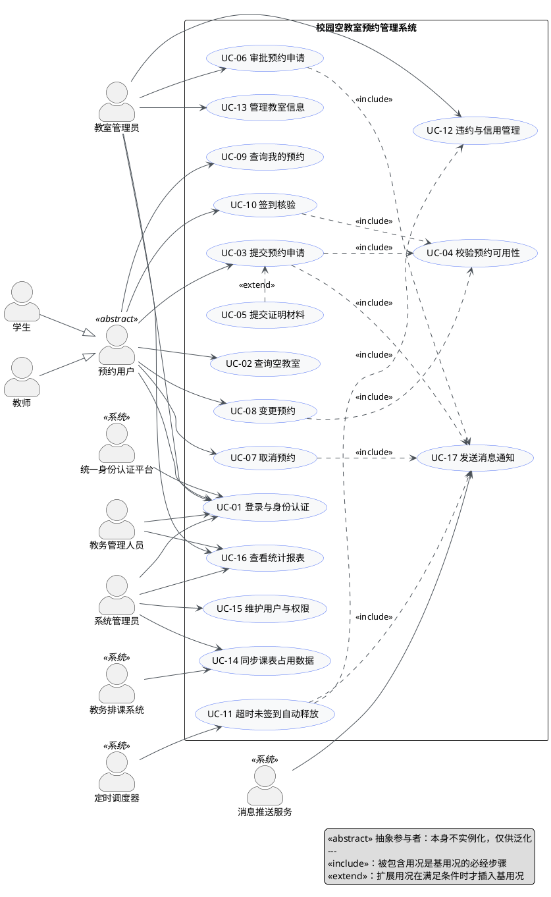
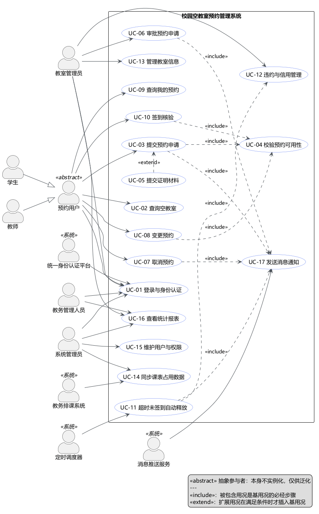
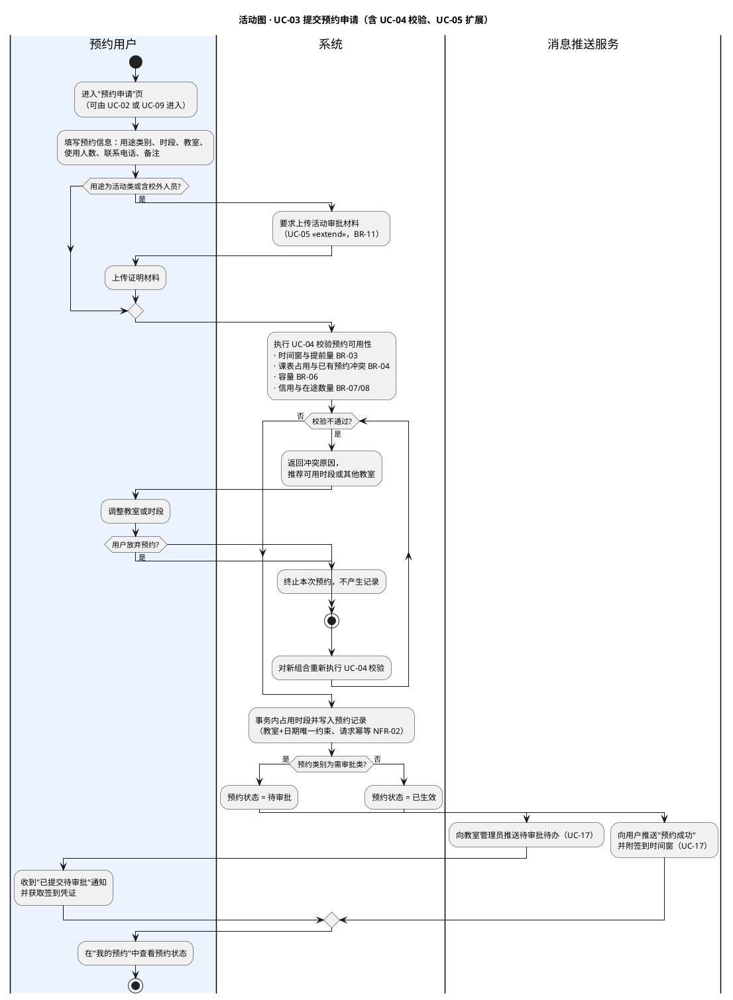
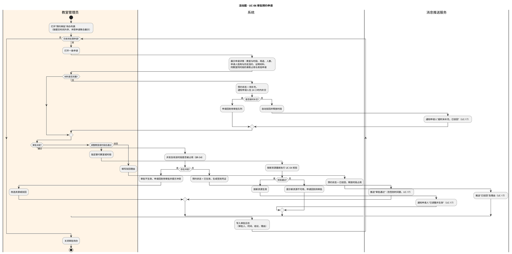
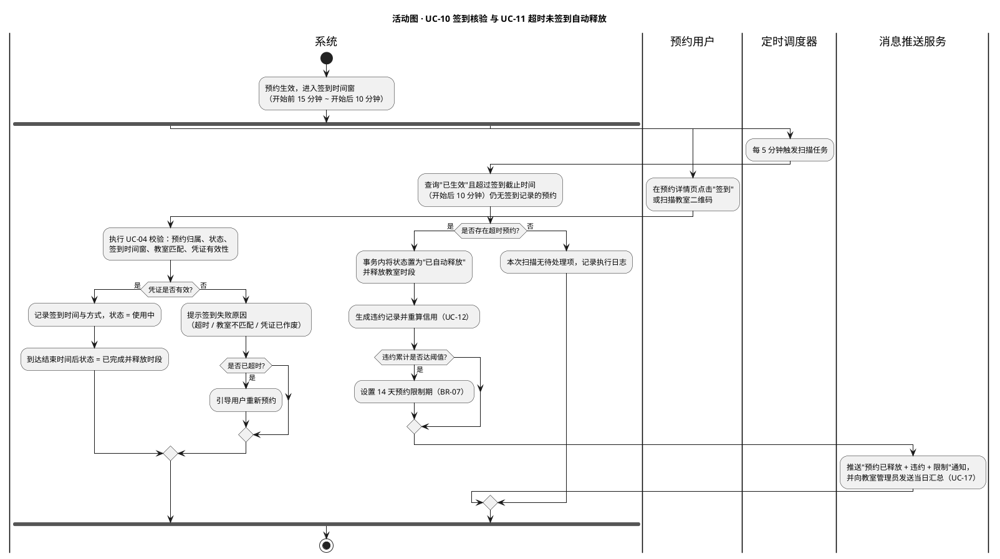
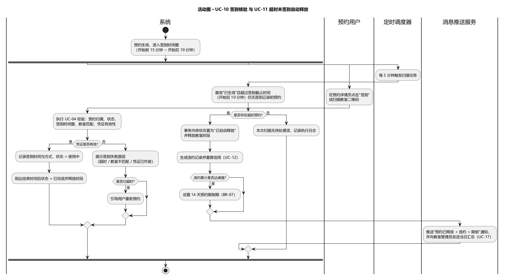

# 校园空教室预约管理系统 · 用况分析

| 项目 | 内容 |
| --- | --- |
| 课程 | 面向对象设计与分析 · 课堂作业（学期课设选题） |
| 选题 | 校园空教室预约管理系统（Campus Free Classroom Reservation Management System, CFRMS） |
| 阶段 | 需求分析（需求说明 → 需求模型 / 用况模型） |
| 交付物 | ① 用况图　② 用况文档（核心用况）　③ 活动图 |
| 版本 | v1.0 |

---

## 0 作业要求识别与判断

### 0.1 图片识别内容

#### 图片一「作业要求1」——PPT《需求分析和系统分析》

> 需求分析的确切含义是对用户需求进行分析，旨在产生一份明确、规范的需求定义。
>
> OOA 的主要内容是研究问题域中与需求有关的事物，把它们抽象为系统中的对象，建立类图。确切地讲，这些工作应该叫做系统分析，而不是严格意义上的需求分析。
>
> 早期的 OOA 缺乏一个良好的基础——对需求的规范描述。
>
> Jacobson 方法（OOSE）提出用况（use case）概念，解决了对需求的描述问题，其分析过程如下：
>
> - 输入：需求说明
> - 分析过程：需求分析 → 健壮分析
> - 输出：需求分析产出「需求模型」，健壮分析产出「分析模型」

#### 图片二「作业要求2」——黑板板书

1. 用况图
2. 用况文档（核心用况）
3. 活动图

### 0.2 作业要求判断

| 观察到的信息 | 蕴含的要求 |
| --- | --- |
| PPT 强调"用况（use case）解决了对需求的描述问题"，并给出"需求说明 → 需求分析 → 需求模型 → 健壮分析 → 分析模型"的过程 | 本次作业处于**需求分析**阶段，产物是**需求模型（用况模型）**，尚不需要类图与设计模型 |
| 黑板板书共三项：用况图、用况文档（核心用况）、活动图 | 交付物为**三件套**：一张完整的用况图、若干净化的核心用况规约文档、若干支撑关键用况的活动图 |
| 两张图片只给出方法要求，未给出具体题目 | 属于**学期课设**题型：需**自行选题**，再针对该选题完成用况分析 |

**结论**：本次作业 = **选题 + 用况分析（用况图 / 核心用况文档 / 活动图）**。

据此选定题目：**校园空教室预约管理系统**。该题目的适配性体现在三点：其一，参与者层次清楚（学生、教师、教室管理员、系统管理员，且学生与教师可泛化为"预约用户"），便于体现 OO 分析中的抽象与泛化；其二，系统边界明确，需与统一身份认证平台、教务排课系统、消息推送服务等外部系统交互，便于体现次要参与者与「include」关系；其三，业务主线"查询空教室 → 提交预约 → 审批 → 签到 → 超时释放"构成完整闭环，既有的分支、异常与并发冲突，也有可深挖的活动图素材。

第 6 节给出由本需求模型继续走向分析模型（健壮分析）的衔接说明。

---

## 1 系统概述

### 1.1 背景与问题

校园教室资源在时间与空间上分布极不均衡：课程表之外存在大量空教室，但师生无法方便地知道"哪间教室、在什么时间、空闲"。线下借用需要到教务处填表、找管理员签字，流程长、信息不透明，而且缺少冲突校验与使用记录，于是出现以下典型问题：

1. **信息不对称**：空教室靠"碰运气"，师生反复跑楼栋，教室在部分时段闲置、在部分时段拥挤。
2. **流程成本高**：一次借用往往需要 1~3 天、多个线下签字环节，临时需求（补课、答疑）几乎无法满足。
3. **冲突与失信**：同一教室被重复许诺给不同的申请人；预约后不来，教室空置且无人知晓。
4. **缺乏度量**：没有使用率、空置率、违约率数据，排课优化与教室建设缺乏依据。

### 1.2 系统目标

| 编号 | 目标 |
| --- | --- |
| O1 | 空教室信息透明化：合并"课表占用 + 已有预约 + 教室状态"，实时给出可预约教室集合 |
| O2 | 预约流程线上化：在线提交、规则自动校验、分级审批、结果自动通知 |
| O3 | 使用过程可核验：签到码 / 扫码核验，超时未签到自动释放，提高教室周转率 |
| O4 | 违约行为可约束：违约累计与信用限制，抑制"约而不用" |
| O5 | 资源使用可度量：使用率、空置率、违约率统计报表，支撑管理决策 |

### 1.3 系统边界与外部系统

| 范围 | 内容 |
| --- | --- |
| **边界内（本系统职责）** | 用户与权限、教室基础数据、空教室计算、预约申请与审批、签到核验、违约与信用、通知编排、统计报表 |
| **边界外（通过接口交互）** | 统一身份认证平台（登录与身份信息）、教务排课系统（课表占用数据）、消息推送服务（短信 / 微信 / 邮件 / 站内信）、门禁或校园一卡通（可选，辅助签到核验） |
| **本期不在范围内** | 教室收费与在线支付、教室设备远程控制、教学视频录制 |

---

## 2 需求说明（用况分析的输入）

### 2.1 功能性需求（FR）

| 编号 | 功能需求 | 关联用况 |
| --- | --- | --- |
| FR-01 | 通过学校统一身份认证登录，并按身份类型加载角色与权限 | UC-01、UC-15 |
| FR-02 | 维护教室基础信息：楼栋、房间号、容量、类型、设备、开放时间、可预约状态 | UC-13 |
| FR-03 | 同步教务排课数据，生成教室"不可预约时段" | UC-14 |
| FR-04 | 按时间段与条件（楼栋、容量、类型、设备）查询空教室并支持排序 | UC-02 |
| FR-05 | 提交预约申请，自动校验时间窗、冲突、容量、信用与在途数量 | UC-03、UC-04 |
| FR-06 | 对活动类、补课、会议等预约进行审批（通过 / 驳回 / 调整资源 / 退回补充） | UC-06 |
| FR-07 | 取消与变更预约，按规则释放时段并判定是否记违约 | UC-07、UC-08 |
| FR-08 | 查询本人预约记录与签到凭证 | UC-09 |
| FR-09 | 签到核验：签到码 / 扫码 / 管理员代签 | UC-10 |
| FR-10 | 超时未签到自动释放教室时段 | UC-11 |
| FR-11 | 记录违约、计算信用、设置与解除预约限制 | UC-12 |
| FR-12 | 消息通知：审批结果、签到提醒、超时释放、违约提醒 | UC-17 |
| FR-13 | 用户与角色权限管理、账号冻结 | UC-15 |
| FR-14 | 使用率 / 空置率 / 违约率统计与报表导出 | UC-16 |

### 2.2 非功能性需求（NFR）

| 编号 | 类别 | 要求 |
| --- | --- | --- |
| NFR-01 | 性能 | 空教室查询 P95 ≤ 2s；预约提交响应 ≤ 3s；支持 3000 并发在线用户、峰值 200 TPS |
| NFR-02 | 并发一致性 | 同一教室同一时段不得存在两条有效预约（唯一约束 + 乐观锁重试）；预约提交与自动释放任务均须幂等 |
| NFR-03 | 可用性与降级 | 7×24 运行，年可用率 ≥ 99.5%；教务排课系统故障时降级为"仅按已有预约与教室状态计算空教室"并在页面明确提示数据可能不完整 |
| NFR-04 | 安全性 | 口令不在本系统存储与传输；全链路 HTTPS；严格校验越权（用户只能操作本人预约）；审批、违约、权限变更操作留痕可审计 |
| NFR-05 | 易用性 | Web 与移动端自适应，核心路径"查询 → 预约"不超过 3 次点击，关键信息（是否需审批、剩余可约时段）前置展示 |
| NFR-06 | 可维护与可扩展 | 用途类别、审批层级、违约阈值、开放时间、可预约天数等业务参数可配置，不硬编码 |
| NFR-07 | 可观测性 | 关键操作日志、审批日志、定时任务执行日志、通知失败重试记录与告警 |

### 2.3 业务规则（BR）

| 编号 | 业务规则 |
| --- | --- |
| BR-01 | 登录一律走统一身份认证，本系统不存储口令；角色由身份类型与系统配置共同决定 |
| BR-02 | 会话有效期 2 小时，空闲 30 分钟自动登出 |
| BR-03 | 仅可预约未来 1~14 天；单次时长 ≤ 4 小时；单用户单日累计 ≤ 6 小时；即时类至少提前 30 分钟、需审批类至少提前 4 小时提交 |
| BR-04 | 时段互斥：同一教室同一时段只允许一条"待审批 / 已生效 / 使用中"的预约，先提交先占用；课表占用时段一律不可预约 |
| BR-05 | 用途分类：即时类（自习、小组讨论）提交即生效；需审批类（补课、答疑、会议、社团活动、含校外人员参与）须经教室管理员审批 |
| BR-06 | 容量约束：使用人数 ≤ 教室容量，超出时提示改选更大教室 |
| BR-07 | 违约与信用：未按时签到、超时未结束且影响他人使用等情况记违约 1 次；违约累计 ≥ 3 次，限制预约 14 天，限制期内仅可查询不可预约 |
| BR-08 | 在途限制：单用户同时处于"待审批 / 已生效 / 使用中"的预约 ≤ 3 条 |
| BR-09 | 审批时限：管理员应在 24 小时内处理，超时升级催办；需调整资源的审批须重新通过 UC-04 校验 |
| BR-10 | 取消规则：开始前 30 分钟（含）以前免费取消；之后取消记违约 1 次；已签到或已开始的预约不可自行取消 |
| BR-11 | 证明材料：用途为社团活动或含校外人员参与时，必须上传活动审批材料，否则不允许提交 |
| BR-12 | 数据留存：预约、审批、签到、违约记录保留 ≥ 1 学年，供统计与审计 |

---

## 3 需求模型：用况模型

### 3.1 参与者识别

| 参与者 | 类型 | 职责 / 动机 | 说明 |
| --- | --- | --- | --- |
| 预约用户 | 抽象参与者 | 抽象出一切"要借用空教室的人"共有行为的父参与者 | 学生、教师的泛化父类，本身不直接实例化 |
| 学生 | 主要参与者 | 自习、小组讨论、社团活动借用空教室；关心"哪里有空、能不能马上用" | 泛化自"预约用户" |
| 教师 | 主要参与者 | 补课、答疑、讲座、会议借用教室；关心"能否安排到合适容量的教室" | 泛化自"预约用户" |
| 教室管理员 | 主要参与者 | 审批预约、维护教室数据、处理违约与申诉、查看统计 | 系统的核心管理者 |
| 系统管理员 | 主要参与者 | 角色与权限分配、账号冻结、系统参数与任务配置 | 关注安全与可维护性 |
| 教务管理人员 | 主要参与者 | 查看全校教室使用率与空置率报表，作为排课与建设依据 | 仅使用统计功能 |
| 统一身份认证平台 | 次要参与者（外部系统） | 提供登录认证与身份信息，本系统不自建账号体系 | 与 UC-01 关联 |
| 教务排课系统 | 次要参与者（外部系统） | 提供课表占用数据，是"空教室"判定的关键输入 | 主动发起 UC-14 |
| 消息推送服务 | 次要参与者（外部系统） | 承载短信 / 微信 / 邮件 / 站内信通知 | 被 UC-17 使用 |
| 定时调度器（Time） | 次要参与者（时间触发） | 按周期触发扫描任务，是系统内部的时间事件参与者 | 触发 UC-11 |

**参与者泛化的理由**：学生与教师对"查询空教室、提交预约、取消预约、签到"等用况的行为完全一致，差异只体现在"可预约的时间窗与用途类别"等业务规则参数上。若把两者分别与全部用况关联，用况图会出现大量重复连线；抽象出"预约用户"后，共性行为上移到父参与者，差异通过业务规则（BR-03、BR-05）表达，模型更简洁、更稳定。

### 3.2 用况识别

分为三类：**主要用况**（参与者直接目标）、**包含型用况**（被其他用况必经调用，无独立参与者）、**扩展型用况**（满足条件时才插入基用况）。

| 编号 | 用况名称 | 主要参与者 | 类型 | 简要说明 | 优先级 |
| --- | --- | --- | --- | --- | --- |
| UC-01 | 登录与身份认证 | 全部用户 | 主要 | 经统一身份认证登录并加载角色与权限 | 高 |
| UC-02 | 查询空教室 | 预约用户 | 主要 | 按时间段与条件查询空闲教室并排序 | 高 |
| UC-03 | 提交预约申请 | 预约用户 | 主要 | 提交教室预约，系统校验后生成预约记录 | 高 |
| UC-04 | 校验预约可用性 | 无（被调用） | 包含型 | 校验时间窗、冲突、容量、课表占用、信用与在途限制 | 高 |
| UC-05 | 提交证明材料 | 预约用户 | 扩展型 | 活动类预约上传活动审批材料（扩展 UC-03） | 中 |
| UC-06 | 审批预约申请 | 教室管理员 | 主要 | 对待审批预约做出通过 / 驳回 / 调整 / 退回补充决定 | 高 |
| UC-07 | 取消预约 | 预约用户 | 主要 | 按规则取消预约并释放时段 | 高 |
| UC-08 | 变更预约 | 预约用户 | 主要 | 修改教室或时段并重新校验（必要时重新审批） | 中 |
| UC-09 | 查询我的预约 | 预约用户 | 主要 | 查看在途与历史预约及签到凭证 | 高 |
| UC-10 | 签到核验 | 预约用户 | 主要 | 用签到码 / 扫码完成签到，确认实际使用 | 高 |
| UC-11 | 超时未签到自动释放 | 定时调度器 | 主要 | 定时扫描并释放超时未签到的预约 | 高 |
| UC-12 | 违约与信用管理 | 教室管理员 | 主要 | 记录违约、计算信用、设置或解除预约限制 | 中 |
| UC-13 | 管理教室信息 | 教室管理员 | 主要 | 维护教室基础数据、设备、开放时间与可用状态 | 高 |
| UC-14 | 同步课表占用数据 | 教务排课系统 | 主要（系统间） | 定时 / 按需同步课表，生成不可预约时段 | 高 |
| UC-15 | 维护用户与权限 | 系统管理员 | 主要 | 角色分配、权限配置、账号冻结 | 中 |
| UC-16 | 查看统计报表 | 教室管理员、教务管理人员 | 主要 | 使用率、空置率、违约率统计与导出 | 中 |
| UC-17 | 发送消息通知 | 无（被调用） | 包含型 | 发送审批结果、签到提醒、超时释放与违约通知 | 高 |

### 3.3 用况图

> 渲染方式（任选其一）：VS Code 安装 PlantUML 扩展后打开 `diagrams/use-case-diagram.puml` 预览；或把上面代码粘贴到 https://www.plantuml.com/plantuml 在线渲染；或本地执行 `java -jar plantuml.jar diagrams/use-case-diagram.puml`。

### 3.4 用况间关系说明

#### 3.4.1 参与者泛化

| 关系 | 说明 |
| --- | --- |
| 学生 ──▷ 预约用户 | 学生继承"预约用户"的全部用况关联（UC-01、UC-02、UC-03、UC-07、UC-08、UC-09、UC-10） |
| 教师 ──▷ 预约用户 | 同上；差异（如用途类别、可预约时间窗）由业务规则表达，不体现在用况数量上 |

#### 3.4.2 «include» 关系（必经调用）

| 基用况 | 被包含用况 | 包含理由 |
| --- | --- | --- |
| UC-03 提交预约申请 | UC-04 校验预约可用性 | 任何预约在写入前都必须通过同一套规则校验，避免规则分散到多个用况 |
| UC-08 变更预约 | UC-04 校验预约可用性 | 变更等价于"取消 + 重新预约"，必须复用同一校验，防止绕过规则 |
| UC-10 签到核验 | UC-04 校验预约可用性 | 签到需判定预约归属、状态、时间窗与教室匹配，复用同一校验规则 |
| UC-03 / UC-06 / UC-07 / UC-11 | UC-17 发送消息通知 | 四类用况均需通知用户，通知能力集中一处，便于替换渠道 |
| UC-11 超时未签到自动释放 | UC-12 违约与信用管理 | 自动释放必须同时生成违约记录并重算信用，是释放的直接后果 |

#### 3.4.3 «extend» 关系（条件插入）

| 扩展用况 | 基用况 | 扩展条件 | 说明 |
| --- | --- | --- | --- |
| UC-05 提交证明材料 | UC-03 提交预约申请 | 用途为社团活动或含校外人员参与（BR-11） | 只有活动类预约才需要上传材料；未上传则不允许提交。UC-05 不在常规路径上，故用扩展而非包含 |

#### 3.4.4 为何不把"审批"直接写成"提交预约"的扩展

审批由**另一个参与者**（教室管理员）在**另一个时间点**、通过**另一个入口**发起，与"提交预约"不是同一会话中的可选步骤，因此应建模为独立的主要用况 UC-06，而不是 UC-03 的扩展。两者的联系通过状态机（待审批 → 已生效 / 已驳回）与共享的 UC-04、UC-17 表达。

---

## 4 核心用况文档

核心用况指直接承载系统业务价值或决定系统正确性的用况。本节对 8 个核心用况（UC-01、UC-02、UC-03、UC-06、UC-07、UC-10、UC-11、UC-13）给出完整规约；其余用况见第 3.2 节的用况列表。

### 4.1 UC-01 登录与身份认证

| 项 | 内容 |
| --- | --- |
| 用况编号 / 名称 | UC-01 登录与身份认证 |
| 主要参与者 | 全部用户（学生、教师、教室管理员、系统管理员、教务管理人员） |
| 次要参与者 | 统一身份认证平台 |
| 简述 | 用户通过学校统一身份认证登录本系统，系统据此获取身份并加载角色与权限 |
| 触发事件 | 用户打开系统首页或会话过期后访问受保护页面 |
| 前置条件 | 用户已持有有效的校园统一身份账号；账号未被冻结 |
| 后置条件 | 成功：建立会话，进入与角色匹配的首页，记录登录日志 失败：不建立会话，停留在登录页并给出可理解的提示 |
| 优先级 / 频度 | 高 / 每次使用系统必发生 |
| 涉及实体 | 用户、角色、权限、登录日志 |

**主事件流**

1. 用户打开系统（Web 或移动端），系统展示欢迎页并重定向到统一身份认证平台。
2. 用户在认证平台输入学号 / 工号与口令（或选择校园扫码登录、短信验证）。
3. 认证平台校验凭据，校验通过后返回认证票据（Ticket / Token）。
4. 系统凭票据向认证平台换取身份信息：姓名、学号 / 工号、身份类型、所属院系。
5. 系统按身份类型映射角色与权限集合，创建服务端会话。
6. 系统跳转到与角色匹配的首页：学生 / 教师进入"空教室查询与我的预约"，教室管理员进入"审批与教室管理"，系统管理员进入"用户与权限"。
7. 系统记录登录日志（用户、时间、来源 IP、登录方式、结果）。

**备选流**

- 2a 用户选择校园扫码登录：认证平台完成扫码确认后返回步骤 3。
- 3a 凭据错误：认证平台提示错误并允许重试；连续 5 次失败锁定该账号 10 分钟，用况以失败结束。
- 4a 身份合法但未在本系统登记：系统提示"账号暂未开通预约服务，请联系教室管理员"，记录日志并用况结束。
- 5a 用户处于违约限制期：允许登录，但预约类功能受限（BR-07），页面对受限状态与解除时间做前置提示。
- 5b 用户同时具备多重身份（如教师兼管理员）：系统提供身份切换入口，切换后重新加载权限。

**异常流**

- E1 统一身份认证平台不可用或超时：系统提示"认证服务暂不可用，请稍后重试"，记录告警，不得开放任何匿名入口。
- E2 会话超时（BR-02）：用户下一次操作时系统提示重新登录，未提交的表单数据尽量保留。
- E3 票据校验成功但换取身份信息失败：系统不建立会话，提示稍后重试并记录异常。

**业务规则**：BR-01、BR-02、BR-07。

---

### 4.2 UC-02 查询空教室

| 项 | 内容 |
| --- | --- |
| 用况编号 / 名称 | UC-02 查询空教室 |
| 主要参与者 | 预约用户（学生、教师） |
| 次要参与者 | 教务排课系统（提供课表占用数据） |
| 简述 | 用户按时间段与筛选条件查询空闲教室，系统合并课表占用、已有预约与教室状态后给出结果 |
| 触发事件 | 用户点击"空教室查询"或从预约流程返回修改条件 |
| 前置条件 | 用户已登录（BR-01） |
| 后置条件 | 成功：返回满足条件的空闲教室列表与可选时段，不修改业务数据 失败：给出明确的失败原因与建议 |
| 优先级 / 频度 | 高 / 高频，预约前的必经步骤 |
| 涉及实体 | 教室、课表占用时段、预约记录、教室设备 |

**主事件流**

1. 用户进入"空教室查询"页，系统默认带出"今天 / 明天的下一个整点时段"。
2. 用户选择日期与时间段（必填），可选填楼栋、容量下限、教室类型（普通 / 多媒体 / 机房 / 研讨）、所需设备、是否只看免审批教室。
3. 系统校验查询条件：日期在允许范围内，时间段合法且长度 ≤ 4 小时（BR-03）。
4. 系统读取教室基础数据、课表占用时段（UC-14 的成果）、有效预约记录与教室可用状态。
5. 系统从教室集合中剔除"课表占用"与"已有有效预约"的教室，得到空闲集合，并按条件过滤。
6. 系统返回结果列表，每行展示：教室（楼栋 + 房间号）、容量、类型、设备、是否需审批、该时段内可连续预约的最长时间。
7. 用户可按"容量 / 距离最近楼栋 / 连续空置时长"排序，或点击某间教室查看该日各时段的空闲明细。
8. 用户选择目标教室并点击"去预约"，流转到 UC-03 提交预约申请。

**备选流**

- 1a 用户未选择时间段直接查询：系统提示"请先选择时间段"。
- 6a 无满足条件的教室：返回空列表，给出放宽条件的建议（延长时段、放宽容量、换楼栋），并可推荐相邻时段的可用教室。
- 7a 用户改用以教室为中心的逆查：选择某间教室后查看其未来 14 天的空闲时段分布。
- 7b 查询结果中的课表数据同步时间早于阈值：结果页标注"课表数据更新于 yyyy-MM-dd HH:mm"，提示数据可能不完整（NFR-03 降级）。

**异常流**

- E1 课表或教室数据读取失败：返回已有预约计算得到的降级结果，并明确标注"未包含课表占用，结果可能不准确"。
- E2 查询超时：提示稍后重试，记录慢查询日志。

**业务规则**：BR-03、BR-04、BR-05、BR-06。

---

### 4.3 UC-03 提交预约申请（核心业务用况）

| 项 | 内容 |
| --- | --- |
| 用况编号 / 名称 | UC-03 提交预约申请 |
| 主要参与者 | 预约用户（学生、教师） |
| 次要参与者 | 教务排课系统（占用数据）、消息推送服务（通知） |
| 简述 | 用户选定教室与时段并提交预约，系统执行可用性校验后生成预约记录，按用途类别置为"已生效"或"待审批" |
| 触发事件 | 用户在空教室查询结果或教室详情页点击"去预约"并提交表单 |
| 前置条件 | 用户已登录；账号不在预约限制期；目标教室处于可预约状态 |
| 后置条件 | 成功：生成唯一预约记录（状态 = 已生效 / 待审批），占用该时段，"我的预约"可查，相关方收到通知 失败：不产生任何预约记录，时段占用不变 |
| 优先级 / 频度 | 高 / 高频，系统核心价值用况 |
| 涉及实体 | 预约记录、教室、时段占用、用途类别、用户信用、通知 |

**主事件流**

1. 用户进入"预约申请"页（可由 UC-02 或 UC-09 进入），系统带出用户身份与已选教室、时段。
2. 用户填写预约信息：用途类别（自习 / 小组讨论 / 补课 / 答疑 / 会议 / 社团活动）、使用人数、联系电话、备注。
3. 用户勾选《教室使用承诺》并提交申请。
4. 系统执行包含用况 UC-04 校验预约可用性：时间窗与提前量、时长与单日累计、课表占用、已有预约冲突、容量、信用与在途数量。
5. 系统在事务中占用时段并写入预约记录：状态先置为"待审批 / 已生效"前的中间态，依赖教室 + 日期的唯一约束保证互斥（BR-04）。
6. 系统按用途类别判定后续状态（BR-05）：
   - 6a 即时类（自习、小组讨论）：状态 = 已生效，进入步骤 7。
   - 6b 需审批类（补课、答疑、会议、社团活动、含校外人员参与）：状态 = 待审批，进入步骤 7，并额外通知教室管理员。
7. 系统生成预约凭证（预约号 + 签到码 + 签到时间窗）。
8. 系统通过消息推送服务（包含用况 UC-17）通知用户：即时类为"预约成功"，需审批类为"已提交待审批"；需审批类同时向教室管理员推送待办（UC-06）。
9. 系统在"我的预约"中展示该记录及其实时状态，用况结束。

**备选流**

- 2a 用途为社团活动或含校外人员参与：插入扩展用况 **UC-05 提交证明材料**，用户必须上传活动审批材料（BR-11）；材料未上传时提交按钮不可用。
- 2b 用户临时更换教室或时段：系统对新组合重新执行步骤 4 的校验，原选择不占用任何资源。
- 4a 时间窗不合法（早于 30 分钟 / 4 小时 / 超出 14 天）：拒绝并说明原因，返回步骤 1。
- 4b 时段已被课表或他人预约占用：高亮冲突原因，展示该教室最近的可选时段或其他教室推荐，返回步骤 1。
- 4c 使用人数超过教室容量：提示并推荐满足容量的最近教室（BR-06）。
- 4d 用户处于违约限制期：拒绝提交并告知限制解除时间（BR-07），用况以失败结束。
- 4e 在途预约已达上限 3 条：拒绝提交并列出当前在途预约，建议先取消或等待（BR-08）。
- 5a 并发抢占：两个用户同时提交同一教室同一时段时，先提交成功者占用时段，后提交者因唯一约束冲突失败，系统提示"该时段刚被占用"并返回步骤 1（NFR-02）。
- 8a 通知发送失败：不影响预约结果生效，系统记录失败任务并按策略重试（最多 3 次）。

**异常流**

- E1 提交过程中网络中断或服务超时：系统以"请求号"保证幂等，同一请求只生成一条预约记录；页面提示用户到"我的预约"确认最终结果，避免重复提交。
- E2 数据库写入失败：事务回滚，时段占用一并撤销，提示用户重试。
- E3 教务排课数据不可用：按 NFR-03 降级处理，允许提交但提示"课表数据可能不完整"，并在同步恢复后对已生效预约做一次冲突复核，若发现课表冲突则通知用户并提供改约建议。

**业务规则**：BR-03、BR-04、BR-05、BR-06、BR-07、BR-08、BR-11。

---

### 4.4 UC-06 审批预约申请

| 项 | 内容 |
| --- | --- |
| 用况编号 / 名称 | UC-06 审批预约申请 |
| 主要参与者 | 教室管理员 |
| 次要参与者 | 消息推送服务 |
| 简述 | 教室管理员对待审批预约做出通过、驳回、调整资源或退回补充的决定，系统据此更新预约状态并通知申请人 |
| 触发事件 | 管理员打开审批待办列表并选择一条申请；或收到新的待审批申请通知 |
| 前置条件 | 管理员已登录且具备审批权限；存在状态为"待审批"的预约 |
| 后置条件 | 成功：预约状态变为"已生效 / 已驳回 / 待补充"，审批日志完整可追溯 失败：申请保持待审批，不影响其他预约 |
| 优先级 / 频度 | 高 / 中高频，活动类与教学类预约必发生 |
| 涉及实体 | 预约记录、审批日志、教室、用户信用、通知 |

**主事件流**

1. 管理员进入"预约审批"待办列表，系统默认按提交时间升序展示，并把同一教室同一日期存在冲突的申请聚合展示、标记冲突。
2. 管理员按楼栋、日期、用途、申请人身份筛选，或直接打开某条申请。
3. 系统展示申请详情：教室与时段、用途、使用人数、申请人及联系方式、信用与历史违约、证明材料，以及同教室同时段的课表占用与其他待审批申请。
4. 管理员做出审批决定：
   - 4a **通过**：进入步骤 5。
   - 4b **调整资源后通过**：指定替代教室或时段，系统按新资源重新执行 UC-04 校验，通过后进入步骤 5；校验不通过则提示原因并返回步骤 4。
   - 4c **退回补充**：填写缺失内容，预约状态 = 待补充，通知申请人在 24 小时内补交；按时补交后回到步骤 3，超时未补交则自动驳回（备选流 4f）。
   - 4d **驳回**：必须填写驳回理由，进入步骤 6。
5. 系统将预约状态置为"已生效"，生成签到凭证，完成时段占用（含并发复核，见备选流 5a）。
6. 系统将预约状态置为"已驳回"，释放此前占用的时段，使该时段可被其他用户预约。
7. 系统通过消息推送服务（UC-17）通知申请人：通过（含教室与时段、签到时间窗）或驳回（含理由）。
8. 系统写入审批日志：审批人、审批时间、结论、理由、是否调整资源。
9. 管理员可对同日同类的多条申请执行批量审批；处理完毕后关闭待办，用况结束。

**备选流**

- 1a 存在超过 24 小时未处理的申请：系统升级催办（列表置顶 + 通知），符合 BR-09。
- 3a 申请缺少必要信息（如活动类缺证明材料，属 UC-03 的漏检）：管理员可直接退回补充（步骤 4c）。
- 4e 多名管理员同时处理存在冲突的两条申请：先完成审批者占用时段，后审批者被拒绝并收到冲突提示，需改选资源或驳回（BR-04、NFR-02）。
- 4f 申请人未在 24 小时内补充材料：系统自动驳回并通知申请人，释放时段。
- 5a 审批瞬间该时段被其他有效预约占用：本次审批不生效，申请回到待审批并提示冲突。

**异常流**

- E1 通知发送失败：审批结果照常生效，失败通知进入重试队列并告警，管理员可在界面上看到"通知未送达"标记。
- E2 审批日志写入失败：整个审批事务回滚，保证"有结论必有日志"。

**业务规则**：BR-04、BR-05、BR-09。

---

### 4.5 UC-07 取消预约

| 项 | 内容 |
| --- | --- |
| 用况编号 / 名称 | UC-07 取消预约 |
| 主要参与者 | 预约用户（学生、教师） |
| 次要参与者 | 消息推送服务；教室管理员（被动接收通知） |
| 简述 | 用户在规则允许的时间范围内取消本人预约，系统释放时段并按规则判定是否记违约 |
| 触发事件 | 用户在"我的预约"中点击"取消预约" |
| 前置条件 | 用户已登录；存在本人名下状态为"待审批 / 已生效"的预约 |
| 后置条件 | 成功：预约状态 = 已取消，时段释放并可被他人预约，签到凭证失效，相关方收到通知 失败：预约保持原状态 |
| 优先级 / 频度 | 高 / 中频 |
| 涉及实体 | 预约记录、时段占用、违约记录、通知 |

**主事件流**

1. 用户进入"我的预约"，选择一条可取消的预约并点击"取消预约"。
2. 系统校验：预约属于本人、状态为"待审批 / 已生效"、尚未签到、尚未开始。
3. 系统判定取消时间是否早于开始时间 30 分钟（BR-10）：
   - 3a 是：提示"免费取消"，不记违约。
   - 3b 否：提示"距开始不足 30 分钟，取消将记违约 1 次"，要求用户二次确认。
4. 用户确认取消。
5. 系统将预约状态置为"已取消"，释放时段占用，并作废该预约的签到凭证（BR-04 语义下该时段恢复可预约）。
6. 系统通过消息推送服务（UC-17）通知用户取消结果；若为需审批类或已生效预约，同时通知教室管理员，便于释放记录与后续安排。
7. 系统按步骤 3 的判定写入违约记录（若需要），并重算用户信用（UC-12）。

**备选流**

- 2a 预约已签到或已开始：不允许取消，提示"请到现场使用或联系教室管理员处理"，用况结束。
- 2b 预约状态为"已驳回 / 已自动释放 / 已完成"：不可取消，仅可查看。
- 3c 用户在二次确认时放弃：用况结束，预约保持原状态。
- 1a 管理员无责取消（教室维修、临时占用、考试封闭）：由管理员操作，不计申请人违约，批量通知受影响用户并推荐替代教室。
- 6a 通知发送失败：不影响取消结果，进入重试队列。

**异常流**

- E1 释放时段时发生数据库冲突：系统重试；仍失败则保持预约状态不变并告警，不得出现"状态已取消但时段未释放"的不一致。

**业务规则**：BR-04、BR-07、BR-10。

---

### 4.6 UC-10 签到核验

| 项 | 内容 |
| --- | --- |
| 用况编号 / 名称 | UC-10 签到核验 |
| 主要参与者 | 预约用户（学生、教师） |
| 次要参与者 | 门禁 / 校园一卡通系统（可选，辅助核验）；教室管理员（代签） |
| 简述 | 用户在签到时间窗内通过签到码或扫描教室二维码完成签到，系统确认实际使用并开始计时 |
| 触发事件 | 用户在预约详情页点击"签到"，或在教室门口扫描二维码 |
| 前置条件 | 用户存在本人当天状态为"已生效"的预约；当前时间处于签到时间窗（开始前 15 分钟 ~ 开始后 10 分钟） |
| 后置条件 | 成功：预约状态 = 使用中，写入签到记录（时间、方式）；到达结束时间后状态 = 已完成并释放时段 失败：不改变预约状态，用户在窗口内仍可重试 |
| 优先级 / 频度 | 高 / 每次使用教室必发生 |
| 涉及实体 | 预约记录、签到记录、教室、用户信用 |

**主事件流**

1. 用户打开预约详情页点击"签到"，或扫描教室门口二维码跳转到签到页。
2. 系统读取签到凭证：预约号、教室编号、时段、随机校验码（扫码时额外校验二维码所属教室）。
3. 系统执行包含用况 UC-04 校验预约可用性，针对签到场景校验：预约归属本人、状态为"已生效"、当前时间在签到时间窗内、教室与预约一致、凭证未被取消或作废。
4. 校验通过后，系统记录签到时间与签到方式，将预约状态置为"使用中"。
5. 到达预约结束时间后，系统将预约状态置为"已完成"并释放时段；若用户需要续用，需重新提交预约或由管理员延期。
6. 系统在详情页展示签到结果与使用中状态。

**备选流**

- 1a 用户无法扫码（手机异常、二维码破损）：可由教室管理员在管理端执行"手动代签"，必须填写原因，记录操作人。
- 3a 凭证无效（教室不匹配、凭证已作废、预约已取消）：签到失败并提示具体原因。
- 3b 已错过签到截止时间：提示"已超过签到时间，预约已被自动释放"，引导重新预约（与 UC-11 衔接）。
- 3c 用户提前超过 15 分钟到达：允许"预签到"占位，但状态仍为"已生效"，不改变可用性判定；或提示"请在签到时间窗内签到"（按学校策略二选一）。
- 4a 对同一预约重复签到：返回首次签到时间，不重复写入记录。
- 5a 结束时间到达但教室内仍有使用者：系统不强制清场，仅记录超时占用并提示，必要时由管理员处理。

**异常流**

- E1 教室区域网络异常：允许客户端离线暂存签到动作，恢复联网后补传；若补传时已超出签到窗口，以服务端时间与本地记录共同判定，异常情况交由管理员裁决。
- E2 门禁 / 一卡通数据不一致（门禁显示无人进入但用户已签到）：仅作提示与统计参考，不自动记违约。

**业务规则**：BR-01、BR-04、BR-07。

---

### 4.7 UC-11 超时未签到自动释放

| 项 | 内容 |
| --- | --- |
| 用况编号 / 名称 | UC-11 超时未签到自动释放 |
| 主要参与者 | 定时调度器（Time，时间触发） |
| 次要参与者 | 消息推送服务；教室管理员（接收汇总与处理申诉） |
| 简述 | 系统按周期扫描"已生效但超时未签到"的预约，自动释放其教室时段、记录违约并通知用户 |
| 触发事件 | 定时调度器按固定周期（每 5 分钟）触发扫描任务 |
| 前置条件 | 系统时间到达扫描点；存在开始时间已过 10 分钟仍无签到记录的"已生效"预约 |
| 后置条件 | 成功：该预约状态 = 已自动释放，时段恢复可预约，生成 1 条违约记录并重算信用；达阈值时设置预约限制 失败：任务记录失败日志并告警，下一次扫描补偿处理（保证幂等，不重复记违约） |
| 优先级 / 频度 | 高 / 每 5 分钟一次 |
| 涉及实体 | 预约记录、签到记录、违约记录、用户信用、通知任务 |

**主事件流**

1. 定时调度器触发扫描任务（每 5 分钟一次，可由系统管理员配置周期）。
2. 系统查询候选集合：状态为"已生效"、开始时间已过 10 分钟、无有效签到记录的预约。
3. 对每条候选预约，系统在事务中：将状态置为"已自动释放"，释放教室时段占用，使该时段重新可被预约。
4. 系统为该用户生成违约记录（类型 = 未按时签到，关联预约号），并重算违约次数与信用状态（包含用况 UC-12）。
5. 判定是否触发预约限制：违约累计 ≥ 3 次则设置 14 天预约限制期（BR-07）；已达限制期的用户仅累加次数，不重复限制。
6. 系统通过消息推送服务（UC-17）向用户推送通知：预约已被释放、本次记违约 1 次、当前违约累计、（如适用）限制解除时间。
7. 系统生成当日汇总（释放数量、涉及用户与教室）抄送教室管理员，供关注与申诉处理。
8. 任务写入执行日志（开始 / 结束时间、扫描数量、处理数量、失败数量），用况结束。

**备选流**

- 2a 候选预约在扫描周期内已被用户签到或取消：跳过该预约，不做任何处理。
- 2b 候选预约所属教室处于"维修 / 封闭"状态：仍按超时释放处理，违约判定照常。
- 4a 教室管理员认定存在正当理由（如身份认证或网络故障、系统故障导致无法签到）：管理员可执行"撤销违约"（UC-12 的扩展行为），系统回滚违约记录并解除因该次违约导致的限制。
- 5a 用户在限制期内再次违约：仅累加违约次数并通知，不叠加新的限制期。

**异常流**

- E1 任务执行失败（数据库或消息服务不可用）：记录失败日志并告警，下一次扫描补偿处理；以"预约号 + 日期"作为唯一键，避免重复记违约（幂等，NFR-02）。
- E2 扫描处理时间超过周期：本次任务完成后顺延启动下一次，任务实例串行化，避免并发重入造成重复释放。

**业务规则**：BR-04、BR-07、BR-10、BR-12。

---

### 4.8 UC-13 管理教室信息

| 项 | 内容 |
| --- | --- |
| 用况编号 / 名称 | UC-13 管理教室信息 |
| 主要参与者 | 教室管理员 |
| 次要参与者 | 教务排课系统（间接：课表归属的教室需与基础数据一致）；消息推送服务（停用时通知） |
| 简述 | 教室管理员维护教室基础数据、设备、开放时间与可预约状态，是空教室计算与预约的前提 |
| 触发事件 | 管理员进入"教室管理"新增、编辑、停用教室，或导入教室清单 |
| 前置条件 | 管理员已登录且具备教室管理权限 |
| 后置条件 | 成功：教室数据与缓存更新，立即影响 UC-02 的查询与 UC-03 的校验结果，变更写入日志 失败：数据保持原状，不产生部分写入 |
| 优先级 / 频度 | 高 / 每学期集中维护，学期中低频 |
| 涉及实体 | 教室、教室设备、开放时间规则、变更日志 |

**主事件流**

1. 管理员进入"教室管理"页，系统分页展示教室列表（楼栋、房间号、容量、类型、状态、是否需审批、最后修改人）。
2. 管理员选择"新增教室"或打开某间教室进行编辑。
3. 管理员填写或修改：楼栋、房间号、容量、教室类型（普通 / 多媒体 / 机房 / 研讨）、设备清单（投影、白板、音响、空调等）、开放时间（按周或按学期生效）、是否允许预约、是否需要审批、负责管理员。
4. 管理员提交，系统校验：房间号在楼栋内唯一、容量 > 0、开放时间区间合法、设备值在字典范围内。
5. 系统保存数据，刷新查询缓存，使新数据立即作用于 UC-02 与 UC-03。
6. 系统写入变更日志（操作人、时间、变更前后值）。

**备选流**

- 2a 管理员使用 Excel 模板批量导入 / 更新教室清单：系统逐行校验，成功的行入库，失败的行返回逐行错误报告，不写入脏数据。
- 6a 停用教室：若该教室存在未来有效预约，系统列出受影响的预约，管理员选择"改派教室"（批量变更，按新教室重新执行 UC-04 校验后通知申请人）或"取消预约"（不计申请人违约）；处理完成后方可停用，避免"已预约教室被直接停用"。
- 6b 临时封闭教室（维修、考试）：支持按时间段封闭，系统即时释放冲突预约并按无责取消处理（BR-10 的例外），通知受影响用户。
- 3a 修改容量导致已有预约超出新容量：系统提示受影响的预约并要求管理员先处理，或允许保存但标记待处理。

**异常流**

- E1 导入文件格式错误或编码异常：整体拒绝并给出模板与填写说明，不产生部分导入。
- E2 缓存刷新失败：数据以数据库为准，系统提示"查询结果可能短暂延迟"并自动重试刷新。

**业务规则**：BR-04、BR-05、BR-12。

---

## 5 活动图

活动图用于描述核心用况内部的**控制流、判断、并发与泳道职责**，是对用况文档中"主事件流 + 备选流"的可视化补充。本节给出 3 张活动图，分别覆盖：预约主线（UC-03）、管理主线（UC-06）、以及"签到与超时释放"这一对时间相关且相互竞争的分支（UC-10 / UC-11）。

### 5.1 活动图：UC-03 提交预约申请

| 活动图要素 | 说明 |
| --- | --- |
| 泳道 | 预约用户、系统、消息推送服务（按"谁负责"划分职责，便于后续分配边界类与控制类） |
| 判断节点 | "用途是否为活动类"（对应 «extend» UC-05）、"校验是否通过"（对应 UC-04 的失败备选流） |
| 循环结构 | "调整教室 / 时段后重新校验"，对应 UC-03 备选流 2b、4b |
| 终止节点 | 用户放弃预约时直接终止，保证"校验不通过则不产生任何占用" |
| 与用况的对应 | 整图即 UC-03 的主事件流 + 备选流 4a~4e 的可视化；UC-04、UC-05、UC-17 以折叠步骤出现 |

### 5.2 活动图：UC-06 审批预约申请

> 说明：图中"材料是否完整"采用**单分支判断**（仅在材料不完整时插入"退回补充"流程），对应 UC-06 主事件流步骤 3 与备选流 3a、4f；材料完整时控制流直接进入审批决定分支。外层 `while` 表示"管理员逐条处理待办列表"。

### 5.3 活动图：UC-10 签到核验 与 UC-11 超时未签到自动释放

本图用 `fork` 表达一对**时间上并行且相互竞争**的分支：用户若在签到截止时间前完成签到，则不会进入超时集合；否则由定时任务释放时段并记违约。

| 活动图要素 | 说明 |
| --- | --- |
| 泳道 | 预约用户、系统、定时调度器、消息推送服务，体现"人触发"与"时间触发"两类不同来源 |
| fork / join | 两条并行分支共享同一预约数据，因此实现时必须用事务 + 唯一约束保证不冲突（NFR-02） |
| 判断节点 | "凭证是否有效"对应 UC-10 备选流 3a/3b；"违约是否达阈值"对应 BR-07 |
| 幂等要求 | 扫描任务以"预约号 + 日期"为唯一键，重复执行不会重复记违约（UC-11 异常流 E1） |

---

## 6 与后续工作（健壮分析 / 分析模型）的衔接

按 0.1 节 PPT 给出的 OOSE 过程，需求分析产出"需求模型"（本文档），下一步是**健壮分析**，产出"分析模型"，即把每个用况映射为三类分析类：

| 用况 | 边界类（Boundary） | 控制类（Control） | 实体类（Entity） |
| --- | --- | --- | --- |
| UC-01 登录与身份认证 | 登录界面、认证适配器 | 登录控制器 | 用户、角色、权限、登录日志 |
| UC-02 查询空教室 | 查询条件界面、结果列表界面 | 空教室查询控制器 | 教室、课表占用、预约记录 |
| UC-03 提交预约申请 | 预约表单界面、凭证界面 | 预约控制器、规则校验器 | 预约记录、教室、用途类别、信用记录 |
| UC-04 校验预约可用性 | 校验结果提示 | 规则校验器（可细分为时间/冲突/容量/信用规则） | 预约记录、课表占用、信用记录 |
| UC-06 审批预约申请 | 审批待办界面、审批详情界面 | 审批控制器 | 预约记录、审批日志、教室 |
| UC-07 取消预约 | 我的预约界面 | 预约控制器 | 预约记录、违约记录 |
| UC-10 签到核验 | 签到界面、扫码入口 | 签到控制器 | 预约记录、签到记录、教室 |
| UC-11 超时未签到自动释放 | —（无人工界面） | 自动释放任务（调度器触发） | 预约记录、违约记录、通知任务 |
| UC-13 管理教室信息 | 教室管理界面、导入入口 | 教室管理控制器 | 教室、设备、开放时间规则 |

由此可进一步识别类之间的关联、聚合与泛化，得到类图（本次作业不要求），并据此划分系统功能模块。

---

## 附录 A 交付物与要求的对应关系

| 黑板要求 | 本文档交付内容 | 位置 |
| --- | --- | --- |
| ① 用况图 | 1 张完整用况图（10 个参与者、17 个用况、include / extend / 泛化关系齐备） | 第 3.3 节；源文件 `diagrams/use-case-diagram.puml` |
| ② 用况文档（核心用况） | 8 份核心用况规约（含主事件流、备选流、异常流、业务规则）+ 17 个用况的清单 | 第 4 节；第 3.2 节 |
| ③ 活动图 | 3 张活动图（UC-03 提交预约、UC-06 审批、UC-10/UC-11 签到与超时释放） | 第 5 节；源文件 `diagrams/activity-*.puml` |

### 需求—用况追溯表

| 功能需求 | 覆盖用况 | 是否有核心用况文档 | 是否有活动图 |
| --- | --- | --- | --- |
| FR-01 统一身份认证与角色加载 | UC-01、UC-15 | 是（UC-01） | — |
| FR-02 教室基础信息维护 | UC-13 | 是（UC-13） | — |
| FR-03 课表占用数据同步 | UC-14 | — | — |
| FR-04 空教室查询与排序 | UC-02 | 是（UC-02） | — |
| FR-05 预约提交与规则校验 | UC-03、UC-04、UC-05 | 是（UC-03） | 是（5.1） |
| FR-06 预约审批 | UC-06 | 是（UC-06） | 是（5.2） |
| FR-07 预约取消与变更 | UC-07、UC-08 | 是（UC-07） | — |
| FR-08 预约查询与签到凭证 | UC-09 | — | — |
| FR-09 签到核验 | UC-10 | 是（UC-10） | 是（5.3） |
| FR-10 超时未签到自动释放 | UC-11 | 是（UC-11） | 是（5.3） |
| FR-11 违约、信用与预约限制 | UC-12 | 是（UC-11 内含） | 是（5.3） |
| FR-12 消息通知 | UC-17 | 见各核心用况的包含步骤 | 是（5.1、5.2、5.3） |
| FR-13 用户与权限管理 | UC-15 | — | — |
| FR-14 统计与报表 | UC-16 | — | — |

## 附录 B 文件清单

| 文件 | 说明 |
| --- | --- |
| `校园空教室预约管理系统.docx` | Word 交付物（正式提交版，含用况图、三人分工、用况文档、活动图） |
| `用况分析.md` | 本报告：要求判断、需求说明、用况模型、核心用况文档、活动图 |
| `diagrams/use-case-diagram.puml` | 用况图源文件（PlantUML） |
| `diagrams/activity-uc03-submit-reservation.puml` | 活动图：UC-03 提交预约申请 |
| `diagrams/activity-uc06-approve-request.puml` | 活动图：UC-06 审批预约申请 |
| `diagrams/activity-uc10-uc11-checkin-release.puml` | 活动图：UC-10 签到核验 / UC-11 超时未签到自动释放 |
| `diagrams/png/*.png` | 已渲染好的位图（4 张，可直接插入 Word 报告） |
| `diagrams/svg/*.svg` | 已渲染好的矢量图（4 张，放大不失真，适合排版） |
| `README.md` | 交付物说明与渲染方法 |

> 本作业的 4 张图已用 PlantUML（UTF-8 编码 + Microsoft YaHei 字体）渲染为 `diagrams/png`（位图）与 `diagrams/svg`（矢量图），可直接使用；若需调整，修改 `.puml` 后重新渲染即可——VS Code 安装 "PlantUML" 扩展（`jebbs.plantuml`）后按 `Alt+D` 预览，或执行 `java -jar plantuml.jar -charset UTF-8 -tsvg -o diagrams/svg diagrams/*.puml`。
